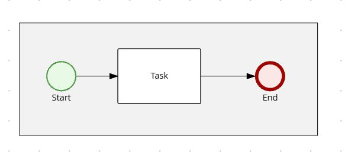

# DOGL

**Dynamic Orchestration Graph Language** — an open language for **business processes** and **orchestration programs**, from **RPA** to **Hyperautomation hub**. DOGL describes processes, orchestration, integrations, and data flows (control flow and information exchange). The scope also includes adapters, data transfer, message broker management, data storage, and related concepts — not all parts are documented in the notation guide yet. BPMN 2.0–compatible and extensible.


Process files use the **.dogl** extension.

## Why DOGL

- **Human-friendly, git-friendly, no-code / low-code** — Plain text, readable by analysts; version and review as code; start with shapes and flows only, add detail when needed.
- **Machine-friendly and AI-friendly** — Easy to parse, unambiguous structure (AST); convenient for tools, runtimes, and AI (analysis, generation, refactoring).
- **Graph-based** — Processes are directed graphs (nodes = elements, edges = flows). This model is a well-established foundation for workflow control flow and verification (e.g. Petri nets, workflow nets, BPMN); DOGL is aligned with it and supports validation and export to diagrams.
- **One source, many uses** — Same `.dogl` file for diagrams, validation, execution, and integration; single JSON AST for Rust, Python, JS, Java, C#.
- **Analyst-first** — Designed so analysts can write and change processes without heavy tools; comments, traceability, and optional complexity (basics without codes, then optional codes and expressions).
- **Extensible** — From simple flows to DMN decisions, call activities, and (planned) adapters, data transfer, and message brokers.
- **Git-diff friendly** — Plain text and clear structure give readable, reviewable diffs; process changes are easy to track and approve in pull requests.

## Portable process logic

DOGL is a **notation that makes process logic portable between systems**. One `.dogl` source can be validated, rendered as a diagram, and exported to **BPMN 2.0** — so the same process can run on **Camunda**, **Flowable**, **Bizagi**, **jBPM**, **Bonita**, or any BPMN-compatible engine. You design in a single, human-friendly format; you choose (or change) the execution platform without rewriting the process.

## Fast deployment: processes in a separate repo

A **dedicated repo for process definitions** pays off when the format is **readable and diff-friendly** — otherwise you get a repo full of XML that nobody wants to edit or review. DOGL gives you plain-text `.dogl` files: analysts and process owners edit in the repo, and changes produce **clear, minimal diffs** that are easy to review and approve. That's what makes the separate-repo pattern work:

- Edit `.dogl`; changes go through normal code review (git diff shows exactly what changed).
- CI builds BPMN (or your engine’s format) and publishes to your BPM engine; no need to redeploy the rest of the stack.
- Shorter cycle for process updates: fix a step, add a branch, or tune a decision — ship the process, not the whole system.

**DOGL + separate repo** = readable, versioned source that feeds your BPM engine. Use it with your BPM system to get portable logic and fast, low-risk process deployments.

## Quick start

No codes, no expressions — just shapes and flows. Four shapes: `()` event, `[]` task, `<>` gateway, `{}` artifact. Connect with `=>` on an indented line under each element. Names in **PascalCase**.


```dogl
collab HelloProcess

() Start
    => Task
[] Task
    => End
() End
```

*Same process — text (above) and diagram (below) are equivalent.*



Save as `.dogl`. **More:** [notation/QUICK_START.md](notation/QUICK_START.md) · [notation/](notation/) (cheat-sheet, full guide).

## Technical

- BPMN 2.0 concepts (events, tasks, gateways, flows); DMN for decisions
- Fast, predictable Rust parser; single JSON AST for Python, JS, Java, C#, Rust

## Usage (Rust)

```rust
use dogl::parse;

let source = std::fs::read_to_string("process.dogl")?;
let ast = parse(&source)?;
```

## License

Dual-licensed under **[MIT](LICENSE-MIT)** or **[Apache-2.0](LICENSE-APACHE)** at your option.
